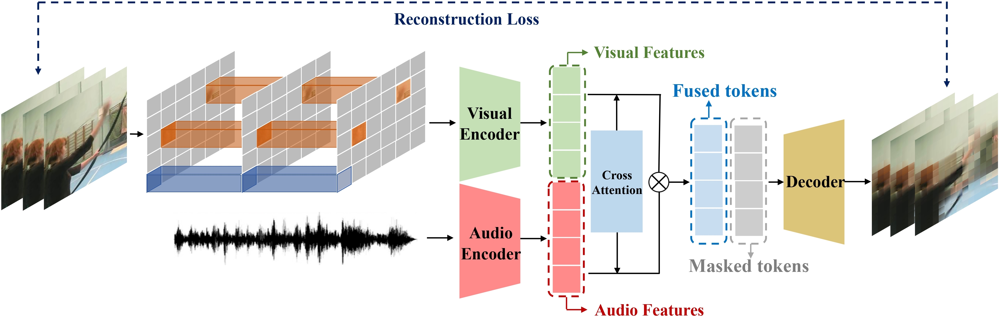

# AV-MAE

Learning high-quality video representation has shown significant applications in computer vision and remains challenging. Previous work based on mask autoencoders such as ImageMAE and VideoMAE have proven the effectiveness of learning representations in images and videos through reconstruction strategy in the visual modality. However, these models show unavoidable limitations when it is difficult to extract features only from the visual modality, especially when the original video is low-resolution and blurry. Inspired by this, we propose Audio-Visual Masked Autoencoder (AV-MAE) that learns video representation effectively by leveraging both visual and audio information to reconstruct the video. Our approach addresses the challenge by demonstrating the complementary nature of audio and video features in cross-modality content. Moreover, our result of the video classification task on the UCF101 dataset outperforms the existing work and reaches the state-of-the-art, with a top-1 accuracy of 98.75% and a top-5 accuracy of 99.92%.

## Experiments

- 1. Video Reconstruction
- 2. Classification
    - 2.1 Training the classification model from scratch (30/100 epochs)
    - 2.2 Fine-tuning on a pre-trained model (i.e., directly loading the pre-trained ImageNet1K model) (1/100 epochs)

### Why using UCF101 
We evaluate our AV-MAE on the commonly used video dataset - UCF101, which consists of over 13k (9.5k/3.5k train/val) video clips across 101 action classes, and is grouped into five types: Human-Object Interaction, Body-Motion Only, Human-Human Interaction, Playing Musical Instruments, and Sports. UCF101 contains web videos captured in uncontrolled settings, typically featuring camera movements, diverse lighting conditions, occasional partial occlusions, and occasional frames of low quality. This makes it an ideal resource for developing an advanced and robust encoder capable of getting high-quality video representations

### How to run the code
 - 1. To run video reconstruction, directly run `scripts/ucf101/videomae_vit_base_patch16_224_tubemasking_ratio_0.75_epoch_3200/pretrain.sh`
 - 2. To run video classification from scratch, run   `scripts/ucf101/videomae_vit_base_patch16_224_tubemasking_ratio_0.75_epoch_3200/finetune.sh`
 - 3. To run video classification using a model pre-trained on the K400 dataset, run `scripts/ucf101/videomae_vit_base_patch16_224_tubemasking_ratio_0.75_epoch_3200/finetune_withpretrained.sh`

### Loss logs (file names inside 'Loss logs' folder)
 - 1. cls pretrain
 - 2. cls_scratch
 - 3. logs_modifed_attention
 - 4. logs_withoutattention orginal
 - 5. orginal

### Sample Video Generated (folder names contains our video reconstruction samples)
 - 1. VideoMAE_Original
 - 2. AV-MAE_withoutAtt
 - 3. AV-MAE

Note: Due to time limitation, We could not make this github super fancy. Thanks for reading!
